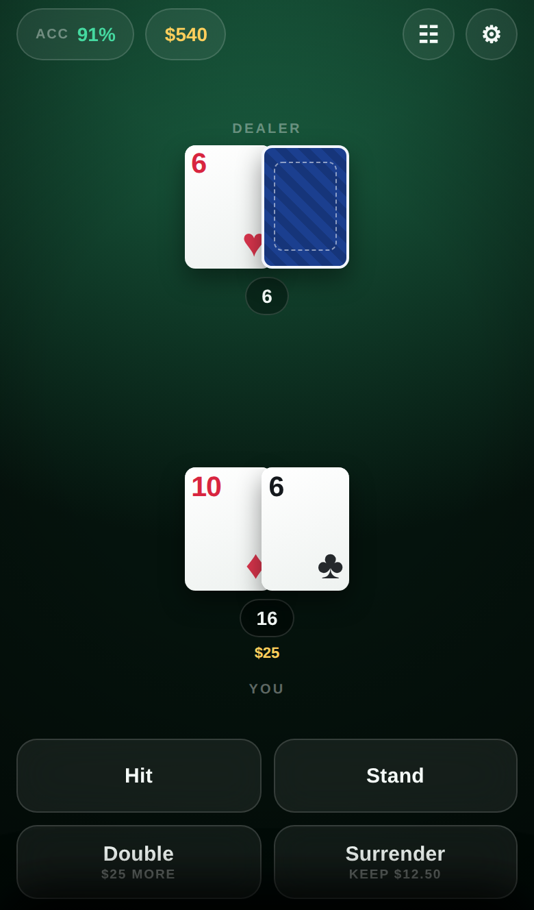
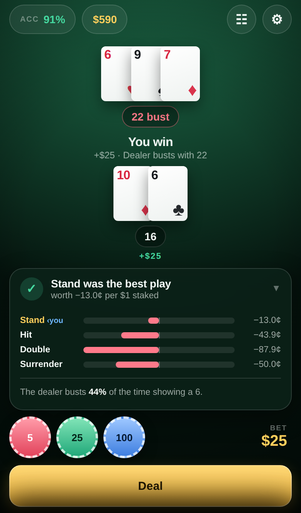
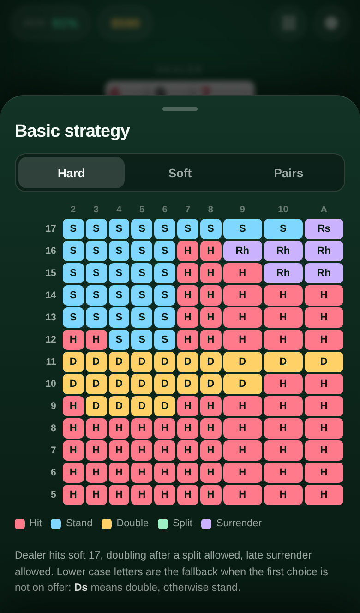

# Blackjack Coach

Learn blackjack by playing it. Every move you make is scored against the mathematically best one, in cents, before the next card lands.

### ▶︎ [arnauddc807.github.io/blackjack](https://arnauddc807.github.io/blackjack/)

Built for a phone. On iOS, tap Share → *Add to Home Screen* and it opens full screen and plays without a signal.

<p>
  
  
  
</p>

## The idea

Sixteen against a six is the hand everyone gets wrong, and winning it teaches you nothing. In the screenshot above the player stood, the dealer busted, and the player made $25 — and the coach still says the best play on the table was worth **minus thirteen cents on the dollar**. Standing was right. The hand was a loser anyway. Results are noise; only the decision is yours.

So the app grades decisions, never outcomes:

| Verdict | Meaning |
| --- | --- |
| ✓ | You picked the best action available. |
| ≈ | Another action was better by less than half a cent on the dollar. Call it even. |
| ✕ | You gave something up, and here is exactly how much. |

Expand any verdict and you get the expected value of standing, hitting, doubling, splitting and surrendering side by side, the dealer's bust chance, and a note when the shoe in front of you disagrees with the printed chart.

## What "best" means here

Most trainers check your move against a basic strategy chart. A chart is an average: it was computed once, for a full shoe, and it cannot know that four aces and eleven tens have already gone by.

This one solves the hand you are actually holding against the cards actually left in the shoe. It walks the dealer's every possible draw, recursively, taking each card with the probability it really has, and does the same for every way you might play the hand out. The number it reports is exact, not simulated — no Monte Carlo, no lookup, no infinite-deck approximation. As a shoe drains, the advice moves with it, and the app tells you when it has moved off the book.

Two simplifications are worth naming: the two halves of a split are valued independently, and the dealer's peek for a natural is applied when the hole card is drawn rather than folded back into your own draw probabilities. Both are standard practice, and neither changes which action wins.

## Playing

- **Chips and a bankroll.** Bet 5, 25 or 100. Blackjack pays 3:2.
- **Everything a real table offers.** Splits to four hands, resplits, doubles, double after split, late surrender, insurance, and a dealer who peeks for a natural.
- **A shoe with a cut card.** It runs down and gets reshuffled, and you can put the Hi-Lo running and true count on screen if you want to practise keeping it.
- **The sound of a table.** Cards on felt, chips into the box, the riffle of a new shoe, and a couple of notes for the verdict and the payout — all synthesised in the browser, so there is nothing to download. Off with one tap in settings, and iOS's silent switch mutes it like anything else.
- **Your own rules.** One to eight decks, dealer hits or stands on soft 17, double after split on or off, surrender on or off. Change any of them and the coach, the chart and the odds all follow.

## Learning

- **Coach after.** The default. Play your hand, then find out.
- **Coach before.** The best action is ringed before you commit. Training wheels.
- **Coach off.** Just deal.
- **Session record.** Accuracy, current and best streak, hands played, money won or lost, and the total expected value you have handed back — plus your recent mistakes, each with the play that would have been better and what it cost.
- **The chart.** Hard totals, soft totals and pairs, drawn for your table's rules and generated by the same solver that grades you, so the two can never disagree. Your current hand is outlined in its cell.

## Under the hood

No framework, no build step, no dependencies. Three libraries and an interface, served as files.

| File | What it does |
| --- | --- |
| `src/Game.js` | The table: shoe, cut card, bets, splits, doubles, surrender, insurance, the peek, settlement. |
| `src/Strategy.js` | The solver, plus the basic strategy chart. |
| `src/Utils.js` | Hand scoring, soft totals, card counting helpers. |
| `src/Probability.js` | The original win/lose/push probability library, untouched. |
| `app/sound.js` | Every noise the table makes, built from oscillators and filtered noise. |
| `app/` | The interface, the styles, and the worker the solver runs in. |

```js
var game = new Blackjack.Game('player', 'house', { numberOfDecks: 6, dealerHitSoft17: true });

game.deal(25);

var analysis = Blackjack.Strategy.analyze({
	counts: game.getUnseenCounts(),                             // what you cannot see, hole card included
	playerCards: game.getHand().getCards(),
	up: Blackjack.Utils.value(game.getDealer().getUpCard()),
	rules: game.getRules()
});

analysis.best;        // "Double"
analysis.ev;          // { Stand: -0.1179, Hit: 0.3399, Double: 0.6799, Surrender: -0.5 }
analysis.basic;       // "Double" — what the chart says
analysis.dealer.bust; // 0.4393
```

Expected values are in units of the original bet, so `+1` is winning it outright and `-0.5` is the cost of a surrender.

### Game

`deal(bet)` · `getActions()` · `hit()` `stand()` `double()` `split()` `surrender()` · `insure(take)` · `playDealer()` · `getHands()` `getHand()` · `getState()` · `getResults()` `getNet()` `getBankroll()` · `getUnseenCounts()` · `getCount()` · `getShoe()` `getPlayer()` `getDealer()` `getTurn()` `setTurn()` `getRules()` `needsShuffle()`

Options: `numberOfDecks`, `dealerHitSoft17`, `blackjackPayout`, `penetration`, `surrender`, `doubleAfterSplit`, `maxSplitHands`, `resplitAces`, `insurance`, `bankroll`, `minBet`.

### Strategy

`analyze(options)` — every legal action's expected value, the best of them, the chart's answer, and the dealer's final total distribution.
`dealer(up, counts, rules)` — the chance the dealer ends on 17 through 21, busts, or turns over a natural.
`basic(hand, up, rules, allowed)` — the textbook play for four to eight decks.
`reset()` — drop the memo tables.

### Utils

`score(cards)` · `hand(cards)` · `value(card)` · `isBlackjack(cards)` · `counts(cards)` · `total(counts)` · `runningCount(cards)`

### Speed

Solving a split against a six-deck shoe takes a couple of hundred milliseconds cold and single digits once the memo tables are warm. The app runs it in a web worker and asks for the answer the moment a decision opens, so the verdict is already waiting when you tap.

## Development

```
npm test      # 21 tests: the engine's rules and payouts, and a sweep of every
              # hard total, soft total and pair against all ten upcards, checking
              # that the exact solver and the printed chart agree
npm start     # serve the app at http://localhost:8080
npm run icons # redraw the app icons
grunt         # lint and build dist/
```

The site is the repository: `index.html` at the root, everything beside it, all paths relative. Whatever is on the default branch is what is live on GitHub Pages — there is nothing to compile and no artifact to publish.

## Credit

The game engine and probability library began as [Chris Zieba's blackjack](https://github.com/ChrisZieba/blackjack), and the write-up behind it is [here](http://chriszieba.com/2015/03/30/blackjack-probabilities). [MIT](LICENSE) licensed.
